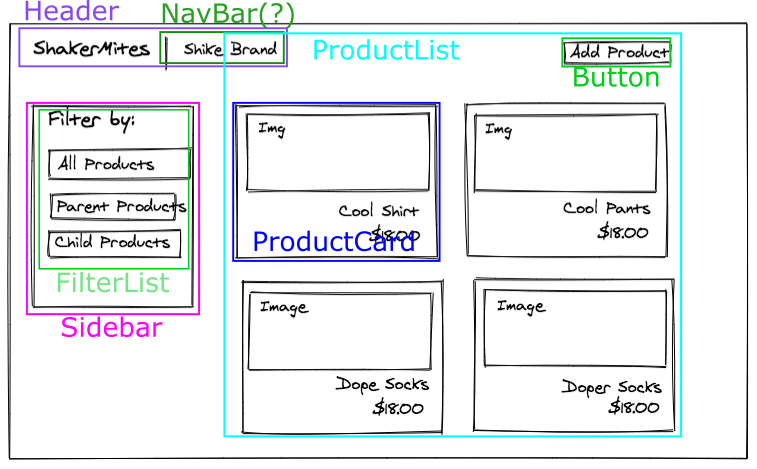

## Makersights takehome

#### Component breakdown

#### API spec

I used NestJS, the API routes are listed in their own controllers in the `/server/src`

Only the `/api/products` route is implemented.

I used mongo so you'll need to connect this to a mongoDB instance, you can specify 
the username and password in `/server/src/app.module.ts`

#### Data schema

Schema for Products, Categories, and Subcategories can be found in the `entities`
directories of each item's directory, eg) `/products/entities/product.entity.ts`

#### Testing

I ran out of time to set it up, but I personally would use Jest and react-test-library
for front-end component unit tests, and cypress for end-to-end and integration tests.

I would use the built in Jest integration in NestJS for unit testing on the backend.

I particularly like to focus on the E2E tests.  Cypress also integrates nicely into 
CI/CD systems.

#### Bonus
I implemented a basic implementation of ProductCard and ProductList in react, it 
is functional if you run the backend.